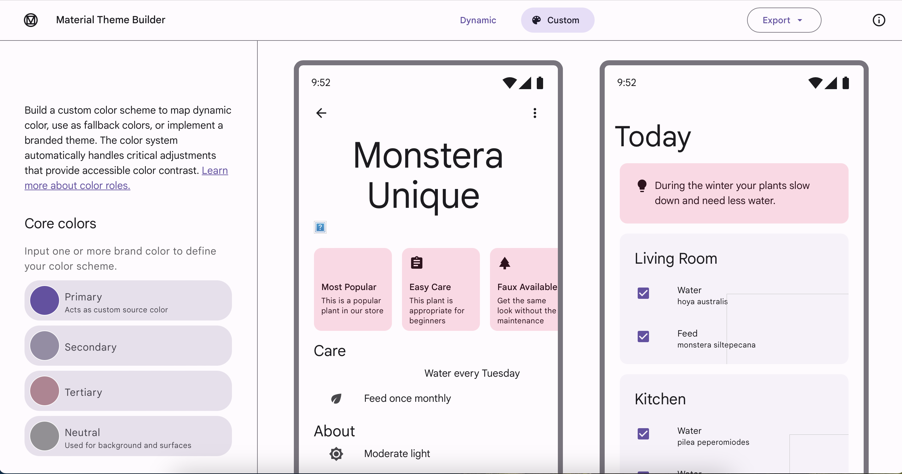

# Contribution

> [!warning] A work in progress page.

If you want to add your own color and don't want me to go through the pain of doing it, please follow the following steps.

1. Visit the [Material Theme Builder website](https://m3.material.io/theme-builder#/custom). It will look something similar to the image below: 
2. Now click on the Primary color and change it with your color of choice.
3. After it creates a theme for you, click on the Export button and export it to `Web (CSS)`.
4. Extract the downloaded zip and you will see a `token.css` inside it.
5. Rename the `token.css` to `_md3-[the name of primary color the you have chosen].css`.
6. Place this inside the `color-schemes` folder of the forked repository.
7.
