# Material Anki

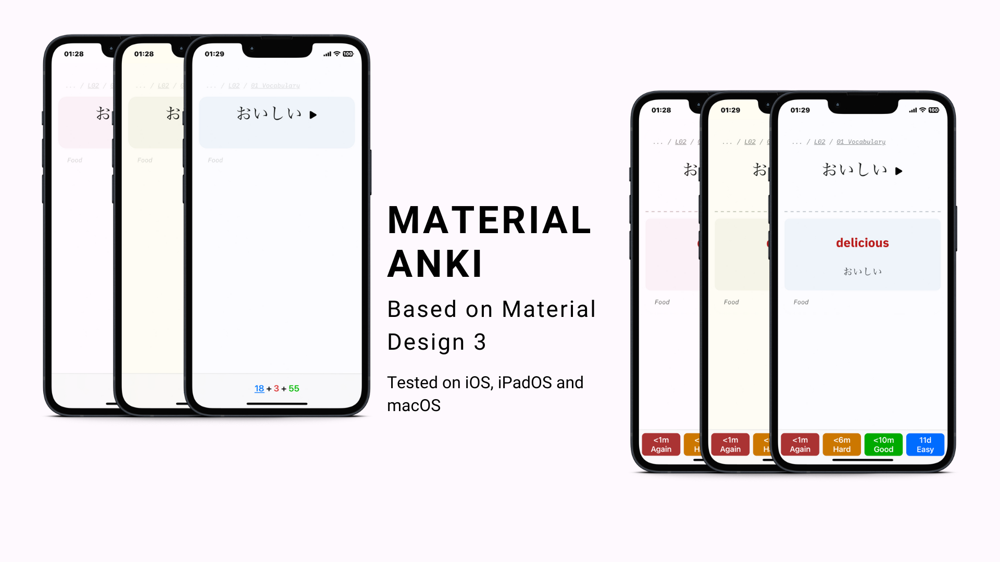

- [Material Anki](#material-anki)
  - [Description](#description)
  - [Preview](#preview)
  - [Installation](#installation)
    - [Direct installation](#direct-installation)
    - [Manual installation](#manual-installation)
  - [Compatibility](#compatibility)
  - [Acknowledgement](#acknowledgement)
  - [Contribution](#contribution)
  - [License](#license)

## Description

I have started learning Japanese language this year （私は今年日本語を勉強し初めまして。）and Anki has been of great help. Even though studying is fun, it sometimes felt boring due to the same old flash cards styles. That is why I tried to make Material Anki.

Although I have shown only the iOS version on the cover image, I have regularly used it on macOS and iPadOS as well. Please fell free to create an issue if you face any problem.

I have followed the [Material Design 3](https://m3.material.io) guidelines for this theme.

P.S. I won't be sharing any Anki Deck containing study materials here. Thank you very much for your understanding.

## Preview

Click on the images to enlarge. Both Light and Dark modes are available!!

  
<h3>macOS</h3>

  
|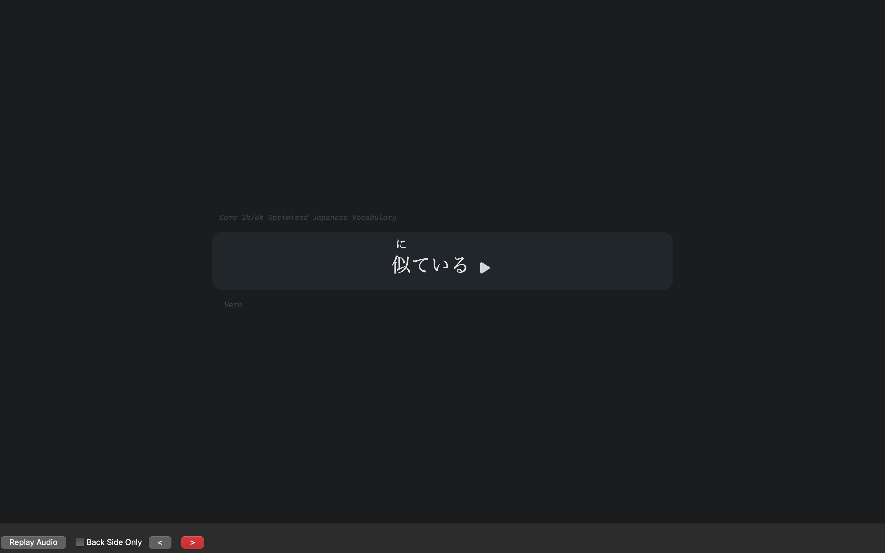|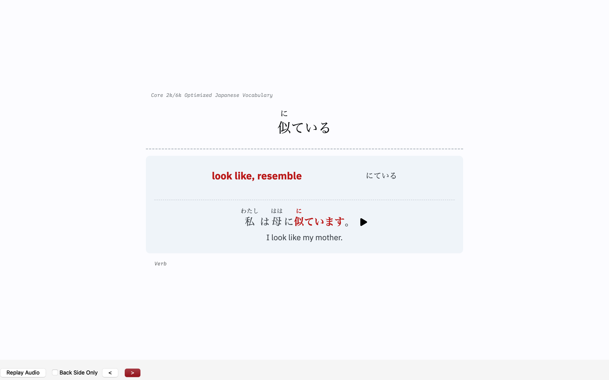|
|:---:|:---:|
|front blue| back blue|
|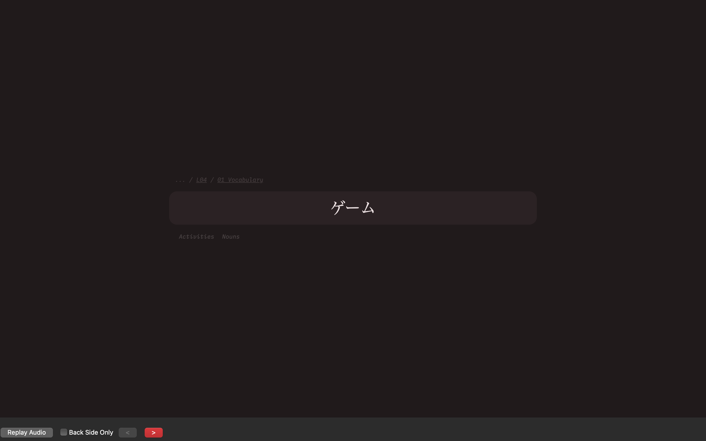|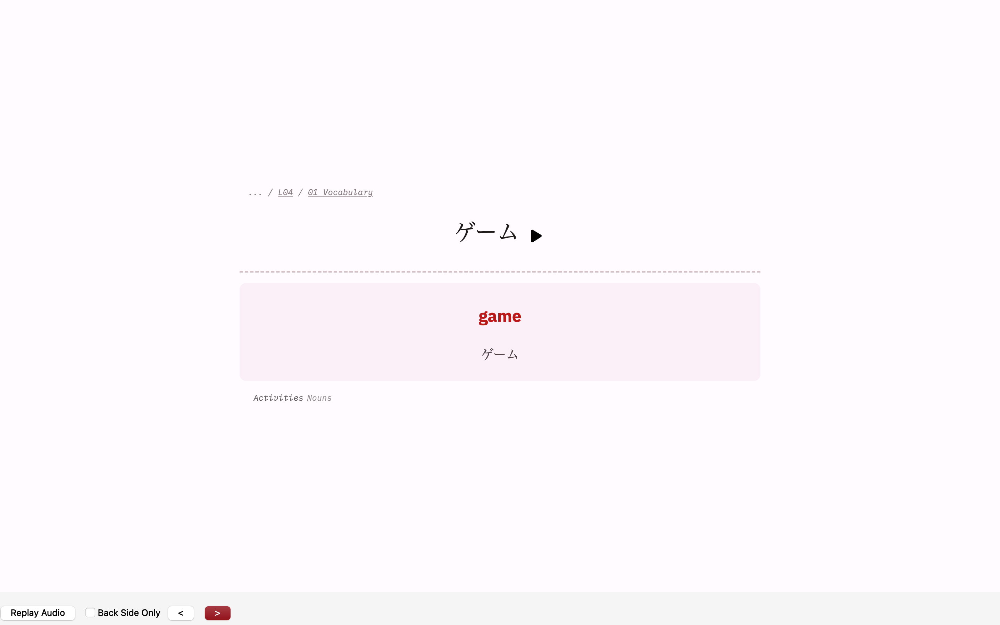|
|front purple| back purple|
|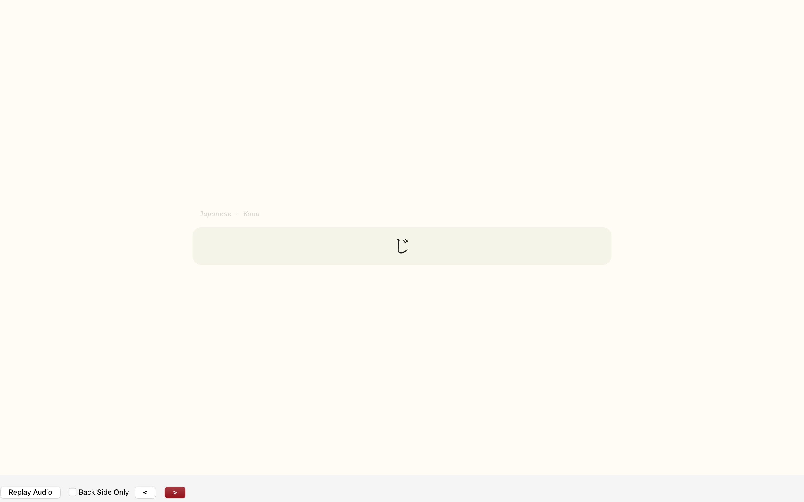|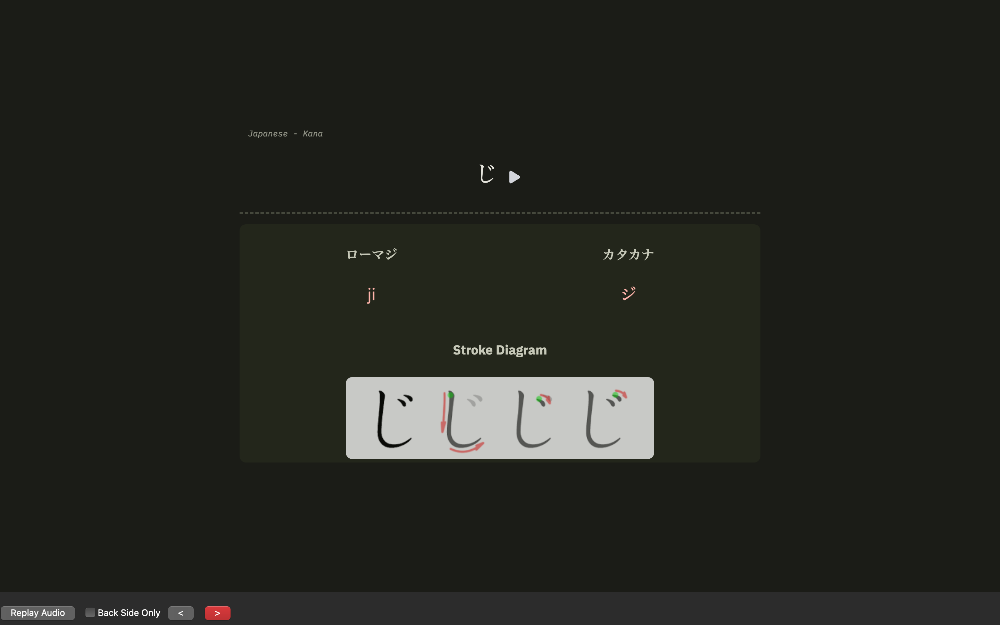|
|front green| back green|

  
<h3>iOS</h3>

  
|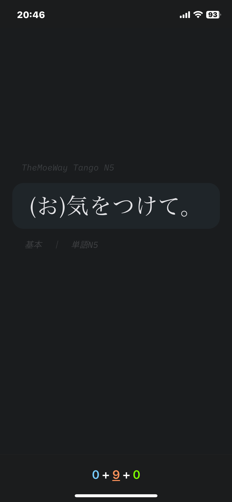|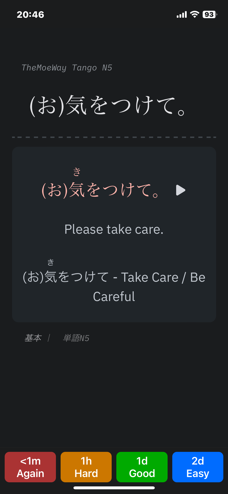|
|:---:|:---:|
|front blue| back blue|
|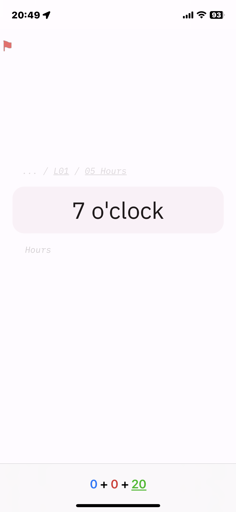|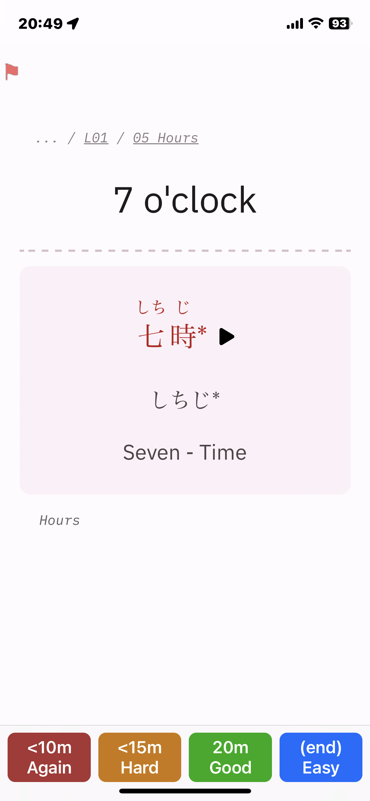|
|front purple| back purple|
|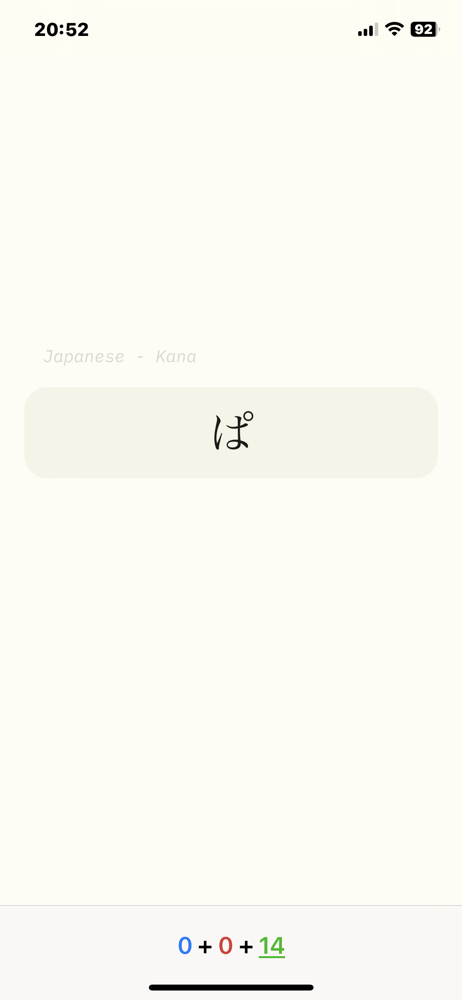|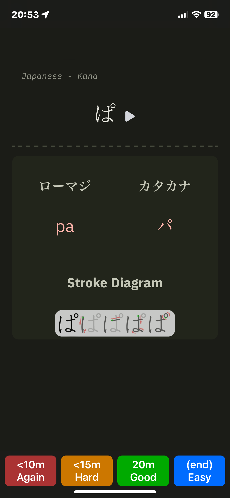|
|front green| back green|

  
<h3>iPadOS</h3>

  
|||
|:---:|:---:|
|front blue| back blue|
|||
|front purple| back purple|
|||
|front green| back green|

## Installation

> [!info] For now things are a bit manual. I will soon upload template decks.

### Direct installation

I will soon release a tempalte deck so that you can just import it and start using Anki. Star this repo to stay tuned.

### Manual installation

1. Download the [latest release](https://github.com/TheFermi0n/material-anki/releases/latest).
2. Extract the zip.
3. Copy everything inside the `resources` folder and paste it into Anki's `collection.media` folder.[^1]
4. Copy the Styling data from the `style.css`` into the "Styling" of a new deck or an already available deck.
5. Use the `front.html` and `back.html` and modify the `Front Template` and `Back Template` respectively. Don't forget to replace the fields as per your deck, or you will be bombared with errors.
6. Now use it to learn something New!!

## Compatibility

This is tested on the following devices[^2]:

- Anki Desktop (macOS): Version 23.10.1
- AnkiMobile (iOS and iPadOS): Version 23.10

## Acknowledgement

I would like to appriciate the designers of  Material Design 3 and the creators of Material Theme Builder. I would also like to thank the creator of [Prettify Anki](https://github.com/pranavdeshai/anki-prettify#plans-for-future) for a great work.

## Contribution

If you have a color suggestion feel free to create an issue. Otherwise, follow the [contrinution guideline](CONTRIBUTION.md) and create a  pull requests accordingly.

## License

This project is licensed under the GNU GPLv3 License - see the [LICENSE](LICENSE) file for details.

[^1]: If you are not familiar with `collection.media`  then please read the ["Files Locations"](https://docs.ankiweb.net/files.html#file-locations) section from the official Anki Manual.
[^2]: This should work on other devices and OS as well. Please do let me know if something goes wrong.
